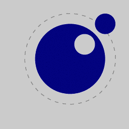

| | |
|---|---|
|
|  |  |

darktable is an open source photography workflow application and raw developer — a virtual lighttable and darkroom for photographers. It manages your digital negatives in a database, lets you view them through a zoomable lighttable and enables you to develop and enhance your raw images.

darktable contains an embedded interpreter for the [Lua](https://www.lua.org) programming language which provides the ability to modify and extend darktable's functionality. This documentation set contains descriptions of the extensions and Application Program Interface (API).

The source repository for this documentation may be found at <https://github.com/darktable-org/luadocs.git>. Any feedback relating to this documentation can be provided by creating a [ticket](https://github.com/darktable-org/luadocs/issues/new) or a pull request against this repository.

darktables main docs can be found [here](https://docs.darktable.org/usermanual/development/en/) and contain a [shortend guide](https://darktable-org.github.io/dtdocs/en/lua/) for setup and scripting with lua.

This documentation is released under the GPL 3.0 license.
